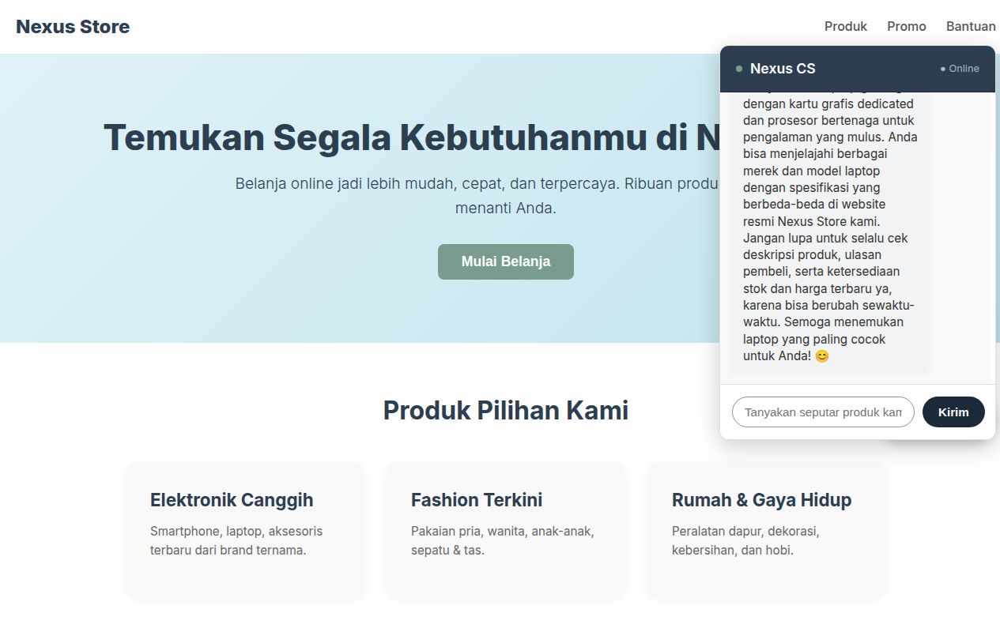

# Gemini Chatbot API — Nexus Store CS

Final Project: **AI Productivity and AI API Integration for Developers** — Hacktiv8.

Chatbot Customer Service Nexus Store dibangun dengan **Google Gemini 2.5 Flash**, backend **Node.js + Express**, dan frontend **Vanilla JS/HTML/CSS**.

## Fitur

- 💬 Floating chat widget di landing page Nexus Store
- 🧠 AI backbone: Gemini 2.5 Flash
- 🧑‍💼 Persona: Customer Service Nexus Store (bahasa Indonesia)
- 🔁 Multi-turn conversation (chat history)
- ⚙️ Parameter: temp 0.7, top_p 0.9, top_k 40
- 🚪 Port dinamis (via `.env`)

## Struktur Proyek

```
Gemini-chatbot-api/
├── public/
│   ├── index.html       # Landing page + chat widget
│   ├── script.js        # Frontend logic (toggle, fetch, conversation)
│   └── style.css        # Styling landing page & widget
├── .env.example         # Template konfigurasi
├── .gitignore
├── index.js             # Backend Express + Gemini API
├── package.json
└── README.md
```

## Instalasi & Menjalankan

```bash
npm install
```

Salin `.env.example` ke `.env`:
```bash
cp .env.example .env
```

Isi `.env` dengan API key Anda:
```
GEMINI_API_KEY=your_api_key_here
PORT=3000
```

Jalankan server:
```bash
node index.js
```

Buka browser: **http://localhost:3000** (sesuaikan port jika diganti di `.env`)

## Penjelasan Parameter

| Parameter | Nilai | Alasan |
|-----------|-------|--------|
| `temperature` | 0.7 | Seimbang antara faktual dan kreatif — tidak terlalu kaku, tidak "ngelantur" |
| `top_p` | 0.9 | Model memilih dari kumpulan token dengan probabilitas kumulatif 90% — respons tetap relevan tapi bervariasi |
| `top_k` | 40 | Membatasi sampling ke 40 token teratas — menghindari token tidak relevan |

## System Instruction

Persona: agen customer service Nexus Store — marketplace online yang menjual elektronik, fashion, kebutuhan rumah, makanan, kecantikan, mainan. Hanya menjawab seputar produk dan layanan. Tidak memberikan alamat fisik atau URL spesifik.

---

## Screenshot



---

Built with ❤️ for Hacktiv8 Final Project.
